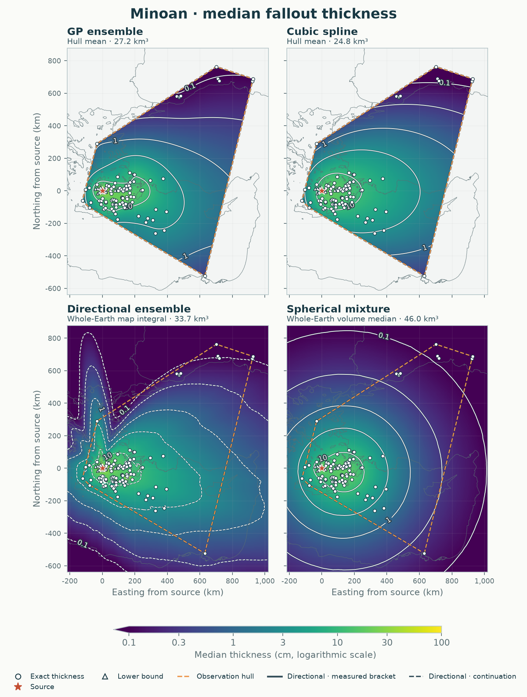
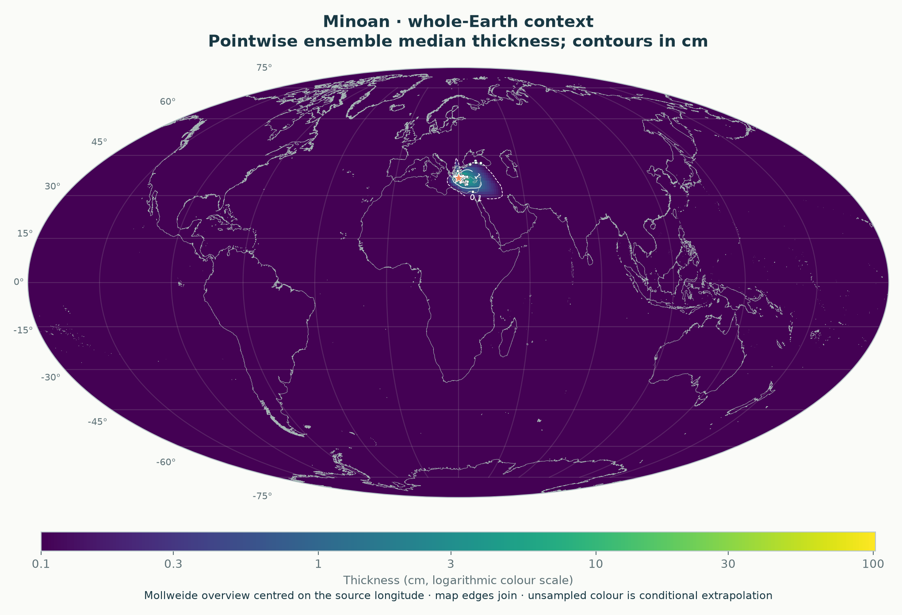

# Minoan fallout reconstruction

The accepted dataset contains 92 exact measurements and 9 lower bounds. The regional fits share an observation hull of 760,879 km². [Accepted thickness CSV](../../data/eruptions/Minoan_tephra.csv) · [Row-level source audit](../../data/audits/Minoan/README.md)

## Isopach fits

All four maps use the same frame, contour levels and thickness scale. Thickness below the first colour-bar tick shares the lowest shade. The dashed line encloses the observation hull. The regional fits stop there. The global fits also show how thickness continues into unsampled ground. On the directional map, white dashes show conditional continuation. Solid white segments connect thicknesses bracketed by measured sites in a supported triangle. Gaps inside the hull can still be poorly constrained.

## Volume and predictive performance

| Method | Bulk volume (km³) | Conditional 95% interval (km³) | Held-out score ↓ | 95% coverage |
|---|---|---:|---:|---:|
| GP ensemble | Hull mean **27.21** | 18.21–40.34 | 1.451 | 96.7% |
| Cubic spline | Hull mean **24.78** | 24.79–25.00 | 1.601 | 96.7% |
| [Directional ensemble](results/directional/README.md) | Whole-Earth median map **33.7** · volume median 42.0 | 26.6–129.1 | 1.695 | 91.3% |
| [Spherical mixture](results/spherical-mixture/README.md) | Whole-Earth volume median **46.0** | 28.1–2,529.2 | 1.570 | 94.6% |

A lower negative log predictive score means better prediction across withheld regions. Each region gets equal weight. Coverage is the share of exact held-out observations inside the 95% predictive interval.

The directional map integrates pointwise median thickness. Measured interpolation triangles account for **7.3%** of its volume. The directional volume interval comes from complete simulated deposits. The regional intervals condition on fitted settings. [Regional maps, fits and diagnostics](results/README.md)

Compare the two whole-Earth maps

| Directional ensemble | Spherical mixture |
|---|---|
|  |  |

Both maps use the vent longitude as their central meridian. Read the thickness key under each map.

## How firmly do the data locate the edge of the deposit?

Letting a poorly constrained fan turn gives a median-map volume of **28.8 km³**. The matched fixed-direction control gives **32.9 km³**. Both use the same training observations and weights. The established six-structure model retains the primary global estimate because predictive performance across withheld directions was mixed.

[Directional extent, map probabilities, sector areas and held-out tests](results/directional/azimuth/README.md)

## Evidence and limitations

The input combines all accepted Plinian and co-ignimbrite airborne fallout fans in one deposit. Nine totals reported with a greater-than sign enter as lower bounds. The reported volumes exclude ignimbrite flow deposits.

The spline’s narrow interval conditions on its fitted trend. Its complete-field draws use a coarser integration grid than the expected-volume calculation, which puts the reported mean just below that interval.

The standard local-support footprint covers 41,066 km². No complete isopach band passed the support and deletion checks. [Support map, partial volumes and rejected contours](results/support/README.md)
